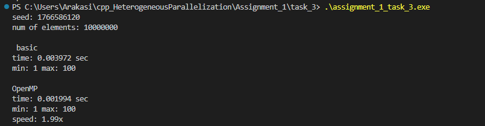

## ASSIGNMENT 1 TASK 3

Все описание кода в комментах кода.

Сравнение реализации методов с или без OpenMP

компиляция:
C:\Users\araka\Desktop\HetParallel\cpp_HeterogeneousParallelization> g++ -fopenmp -O2 .\assignment_3\assingment_1_task_3.cpp -o .\assignment_3\assignment_1_task_3

запуск:
C:\Users\araka\Desktop\HetParallel\cpp_HeterogeneousParallelization> .\assignment_3\assignment_1_task_3.exe
## Результаты
```
seed: 1766586120
num of elements: 10000000

 basic
time: 0.003972 sec
min: 1 max: 100   

OpenMP
time: 0.001994 sec
min: 1 max: 100   
speed: 1.99x    
```

