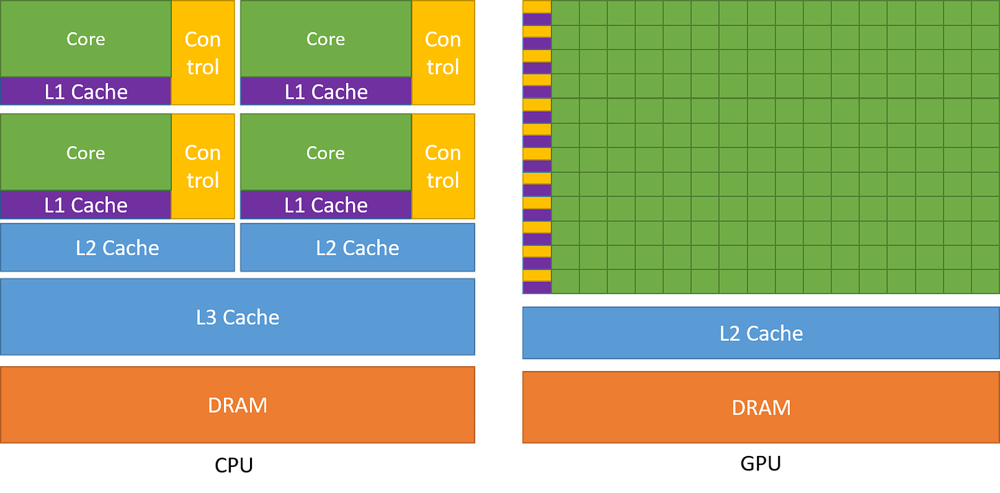

Задача 1. Введение в гетерогенную параллелизацию
Теоретическое задание (25 баллов)
Объясните, что такое гетерогенная параллелизация.
В ответе раскройте следующие аспекты:
- различия между параллельными вычислениями на CPU и GPU;
- преимущества гетерогенной параллелизации;
- примеры реальных приложений, в которых используется гетерогенная параллелизация.

Ответы:
Основной концепт гетерогенной параллелизации заключается в распределении между разными типами процессоров (CPU, GPU) в зависимости от того, какой из них эффективнее справится с конкретной работой. Главное различие между CPU и GPU заключается в их целевых задачах при проектировании. В CPU может находиться до нескольких десятков ядерь, которые  изначально разрабатывались для выполнения последовательных инструкции, в течении многих лет в архитектуру вводились улучшения для уменьшению задержки выполнения инструкций. Одной из функций является многоуровневые кэши. 

В свою очередь GPU были спроектированы для работы с огромным уровнем параллелизма (и высокой пропускной способностью), имея тысячи ядер (но жертвуя задержкой выполнения инструкций)

Например - CPU, благодаря своей низкой задержке, может сложить малые числа гораздо быстрее, однако, в случае милионных или миллиардных операций GPU справится намного быстрее (благодаря параллелизму)

Имея эти базовые входные можно дальше идти -> а что если мы объединим эти два относительно разных вычислительных устройства, возьмем преимущества 

Это нас приведет к следующим плюсам:
-> оптимальное распределние нагрузки, где CPU обрабатывает управляющую логику, а GPU будет работать с огромными параллельными вычислениями

В целом это полезно, когда задачи более точечно идут к наиболее эффективному процессору 

В целом используется для многих вещей

Начиная от близких ко мне игр, заканчивая криптографией и майнингом. В первый раз с CUDA познакомился на курсе Computer Vision.