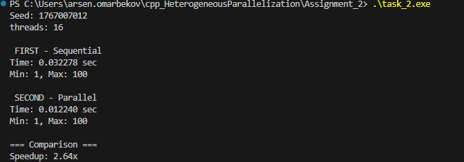

В целом результаты говорят сами за себя.
Кол-во чисел в массиве увеличил, так как у меня 16 ядер и разницы при меньшем размере массива не было
Практически в три раза улучшился результат, что наглядно демонтстрирует преимущество гетерогенной параллелизации, когда несколько ядер параллельно берут на себя части массива для обработки 

Seed: 1767007012
threads: 16

 FIRST - Sequential
Time: 0.032278 sec
Min: 1, Max: 100

 SECOND - Parallel
Time: 0.012240 sec
Min: 1, Max: 100

=== Comparison ===
Speedup: 2.64x