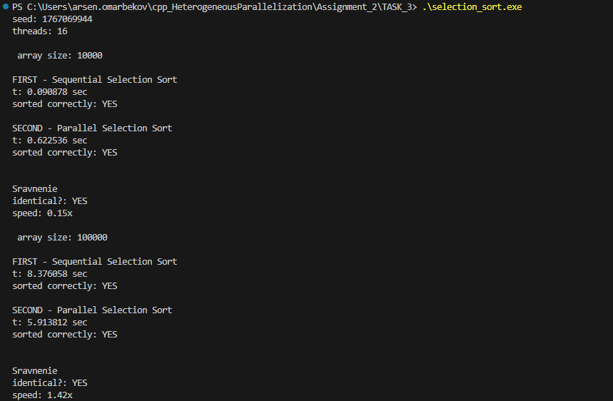
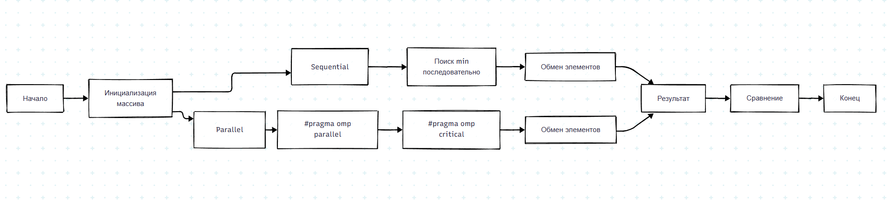

При запуске кода вышли следующие результаты:

Как говорилось в лекции, не все алгоритмы одинаково хорошо параллелятся

Логично что сортировка выбором является плохой кандидат для OpenMP из-за зависимости данных между итерациями

Сама схема выгядит следующим образом:

Приходя к выводам Параллельная версия работает быстрее, но ускорение небольшое (около 1.4х). Это связано с тем, что в сортировке выбором каждая итерация зависит от предыдущей - мы не можем полностью распараллелить весь алгоритм