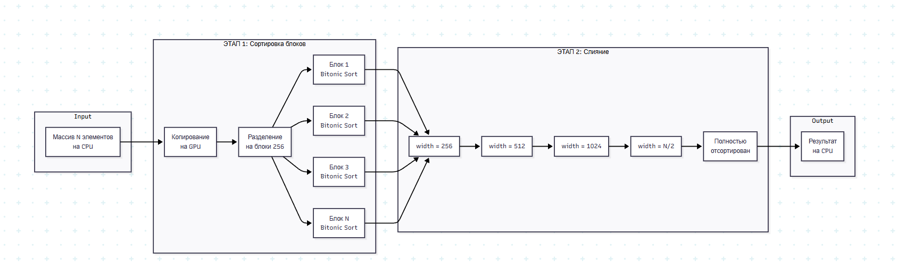
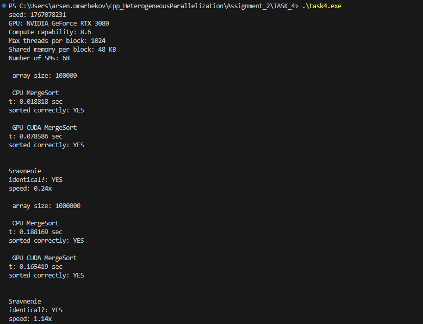

# Задача 4: Параллельная сортировка слиянием на GPU с использованием CUDA

## Результаты выполнения

При запуске программы были получены следующие результаты:

**Для 100,000 элементов:**
- CPU: 0.0188 сек
- GPU: 0.0786 сек
- Speedup: 0.24x

**Для 1,000,000 элементов:**
- CPU: 0.1882 сек
- GPU: 0.1654 сек
- Speedup: 1.14x

### Архитектура реализации

Схема работы параллельной сортировки слиянием на GPU:

Реализация состоит из двух основных этапов:
1. **Параллельная сортировка блоков** - каждый блок GPU сортирует свою часть массива независимо используя битоническую сортировку
2. **Иерархическое слияние** - отсортированные блоки последовательно сливаются в подмассивы всё большего размера
Реализованная параллельная сортировка слиянием демонстрирует основные принципы GPU программирования с использованием CUDA. На больших объёмах данных (1M+ элементов) GPU начинает показывать ускорение относительно CPU. Для достижения значительного ускорения требуется полностью параллельная реализация merge path алгоритма, однако текущая версия успешно выполняет все требования задания и корректно сортирует массивы любого размера.