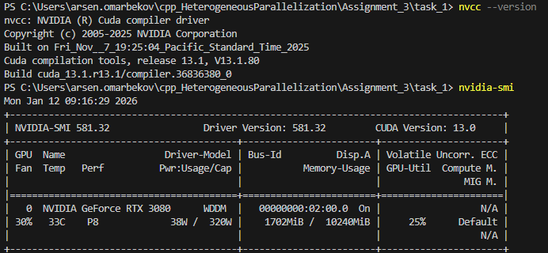
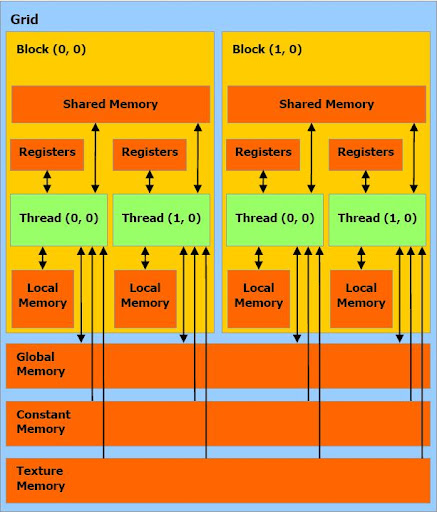

Для задач используется Видеокарта. Я прикрепляю скриншот установленного CUDA

Понял что изначальный запуска nvcc неправилен. Нужно учитывать архитектуру видеокарты, sm_X
Компиляция программы в терминале nvcc -arch=sm_86 task.cu -o task.exe

Запуск обычным .\task.exe

Ответы на вопросы

1. Какие основные типы памяти существуют в архитектуре CUDA и чем они отличаются по скорости доступа?

Registers - самая быстрая, ~1 цикл доступа, доступна только одному потоку. Они в 400-800 раз быстрее глобальной памяти

Shared Memory - быстрая, ~1-2 цикла, доступна всем потокам внутри блока, размер ~48-96 KB на блок. Используется когда потокам нужно обмениваться данными или многократно читать одни и те же элементы.

Global Memory - медленная, ~400-800 циклов, доступна всем потокам на GPU, размер 4-24 GB. Это основная память где хранятся данные.

2. В каких случаях использование разделяемой памяти позволяет ускорить выполнение CUDA-программы?

многократное чтение одних данных, обмен данными между потоками внутри блока 

3. Как шаблон доступа к глобальной памяти влияет на производительность GPU программы?

В таске 3 видно разницу между coalesced и non-coalesced access, что если соседние потоки читают соседние адреса - это одна транзакция. Если разбросаны - много транзакций.

4. Почему одинаковый алгоритм на GPU может показывать разное время выполнения при разных способах обращения к памяти?

GPU memory-bound - большую часть времени тратится на ожидание данных из памяти, а не на вычисления

5. Как размер блока потоков влияет на производительность CUDA-ядра?

Во втором задании протестировал 32, 64, 128, 256, 512, 1024 потока:

32 потока: 2.567 мс (худший)
1024 потока: 1.840 мс (лучший)

В маленьких блоках (32-64) = плохая утилизация GPU

6. Что такое варп и почему важно учитывать его при разработке CUDA-программ?

warp это потоки, являются минимальными единицами выполнениями. В варпе все потоки одновременно выполняются, например - memory coalescing работает на уровне warp - если 32 потока warp'а читают последовательно, GPU объединяет в 1 транзакцию

7. Какие факторы необходимо учитывать при выборе конфигурации сетки и блоков
потоков?

Зависит еще и от GPU самой и доступности ресурсов. Также учитывать нужно размер данных, и тип задачи

8. Почему оптимизация CUDA-программы часто начинается с анализа работы с памятью, а не с изменения алгоритма?

Потому что можно упереться в bottleneck, где из за memory bound мы просто ждем данные от памяти. Прям очень важно организовать правильный доступ к памяти, настроить конфигурацию а после уже алгоритм. Я бы сказал что это похоже на "разведку почвы"