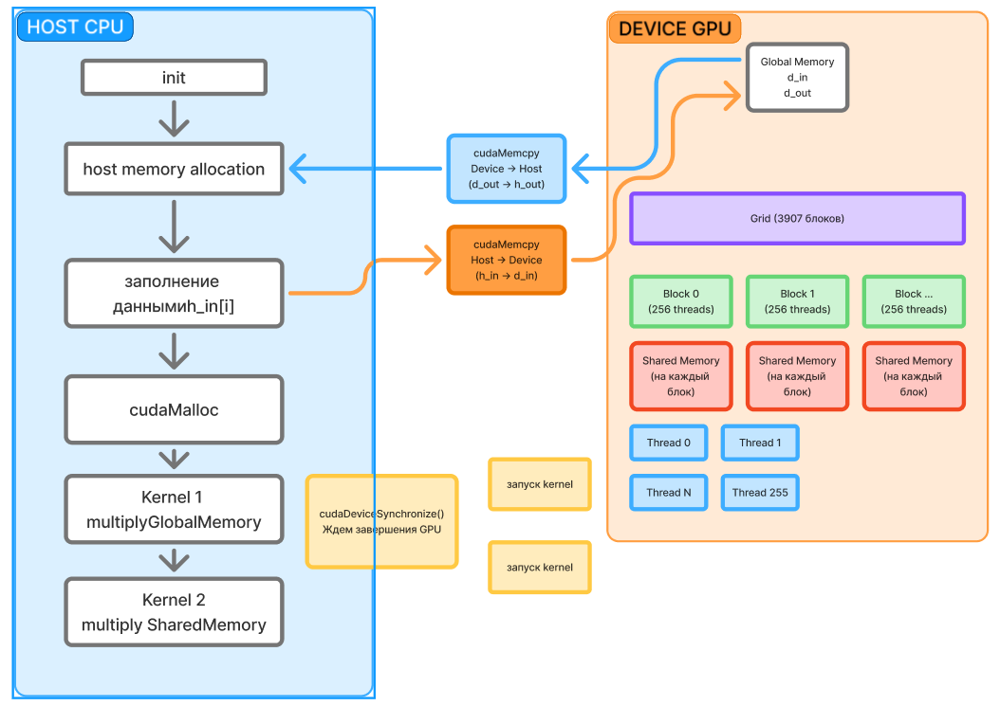
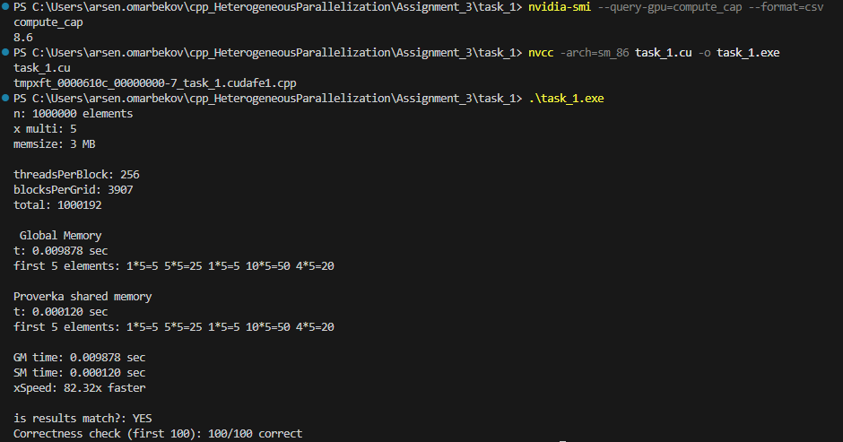
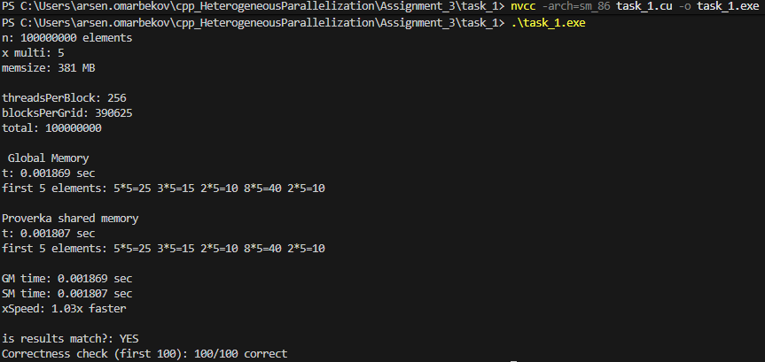

Блок схема

### Первоначальные измерения (N = 1 000 000 элементов)

- Global Memory: 0.008582 сек
- Shared Memory: 0.000101 сек
- **Ускорение на 84.72x**

Как я понял это недостаточный размер данных, kernel уж слишком быстро запускается

Поэтому увеличиваем до 100 000 000 элементов

GM time: 0.001869 sec
SM time: 0.001807 sec
xSpeed: 1.03x faster

для поэлементного умножения результаты адекватнее