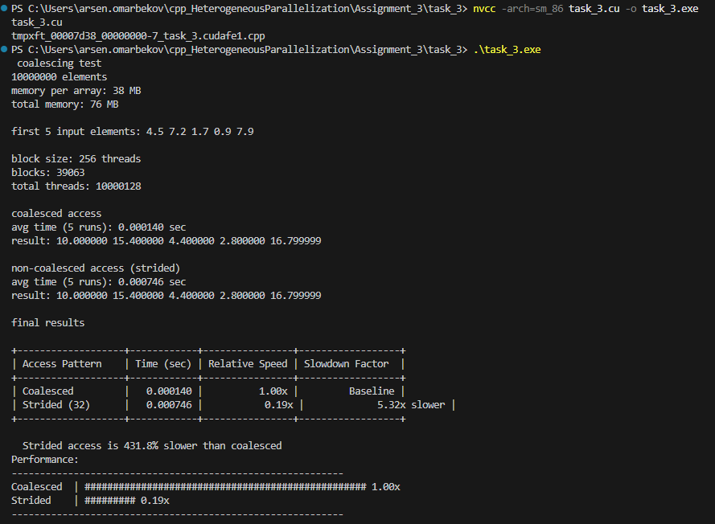
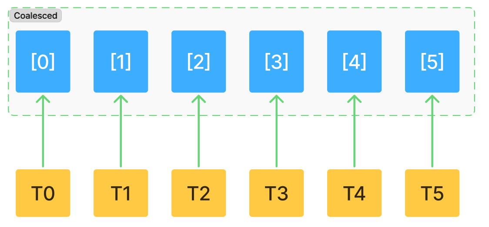
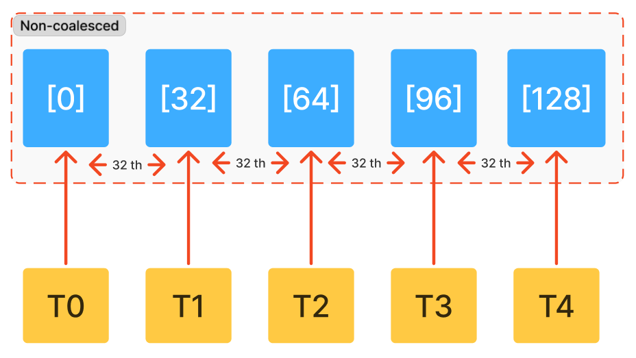

Coalesced access - соседние потоки читают соседние элементы памяти (Thread 0 читает element[0], Thread 1 читает element[1] и т.д.)

Non-coalesced access - потоки читают память с большим шагом (Thread 0 читает element[0], Thread 1 читает element[32], Thread 2 читает element[64])

в non-coalesced access каждый поток обращается к разным участкам памяти, где gpu делает до 32 лишний транзакций. Поэтому очень важно использовать последовательный доступ, где соседние потоки читают соседние адреса