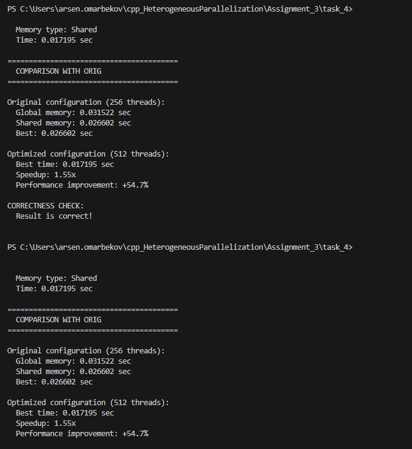
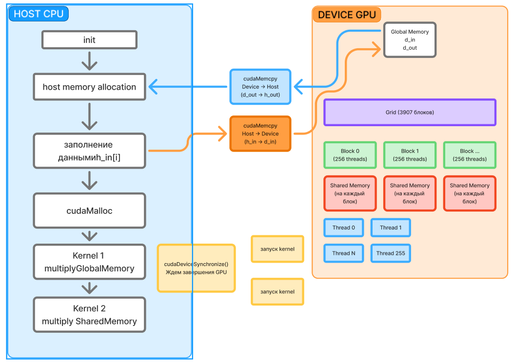

Результаты

исходный размер блока в 256 потоков не является оптимальным для данной задачи. 

увеличение размера блока до 512 потоков в сочетании с использованием разделяемой памяти дает значительное ускорение работы программы.

Схему взял с первого таска

