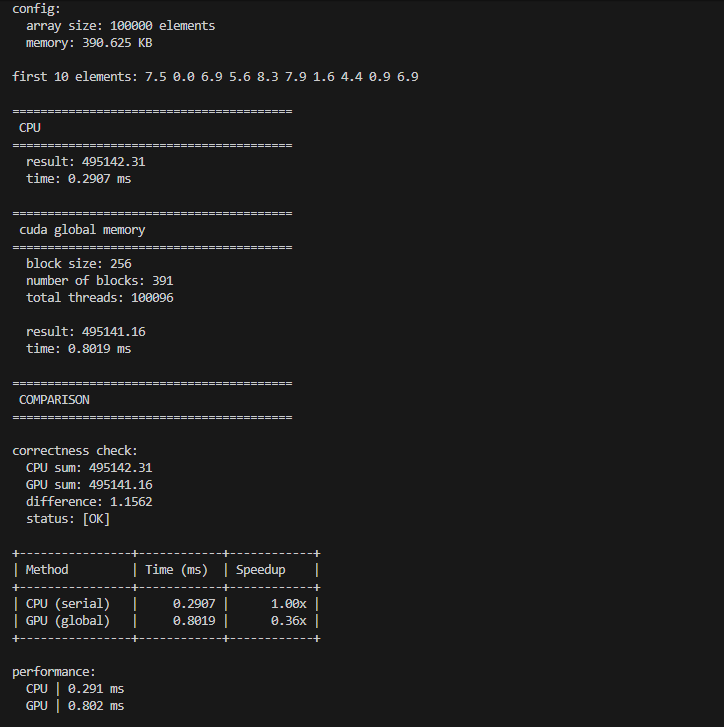
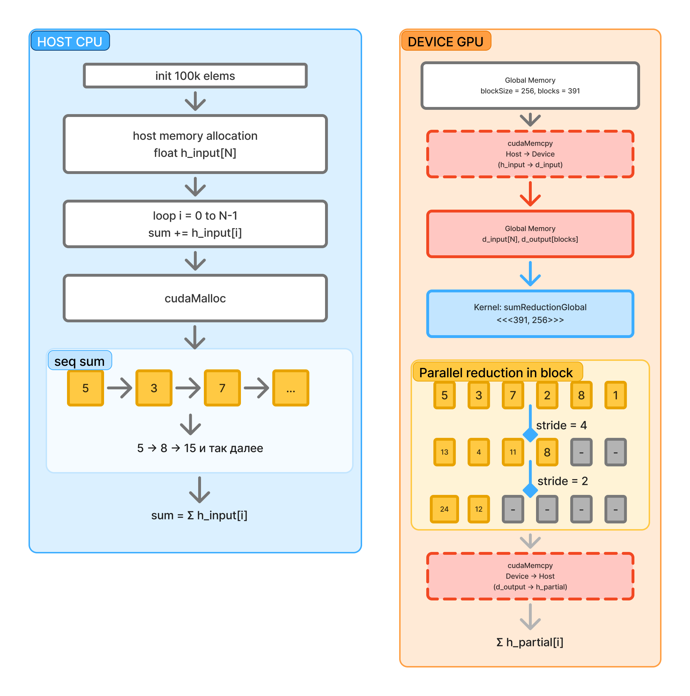

В целом массив суммируется двумя способами - последовательно на CPU (простой цикл) и параллельно на GPU (редукция через global memory). 

GPU использует 391 блок по 256 потоков, каждый блок вычисляет частичную сумму, затем CPU суммирует результаты блоков.

results

schema

Две колонки - CPU (зелёная) и GPU (оранжевая)

Показан последовательный цикл на CPU vs параллельная редукция на GPU со стрелками stride=4→2→1. 