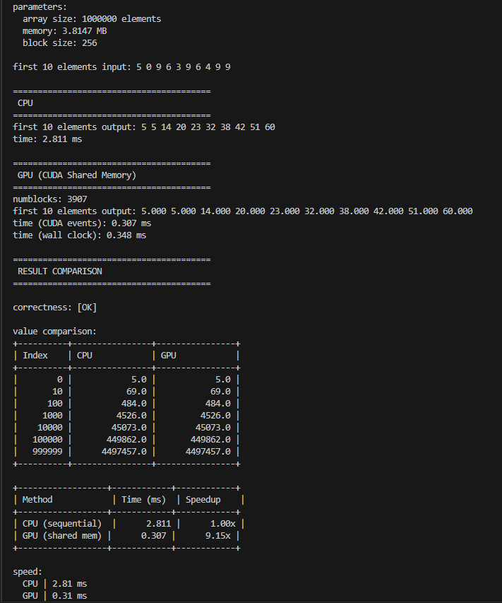
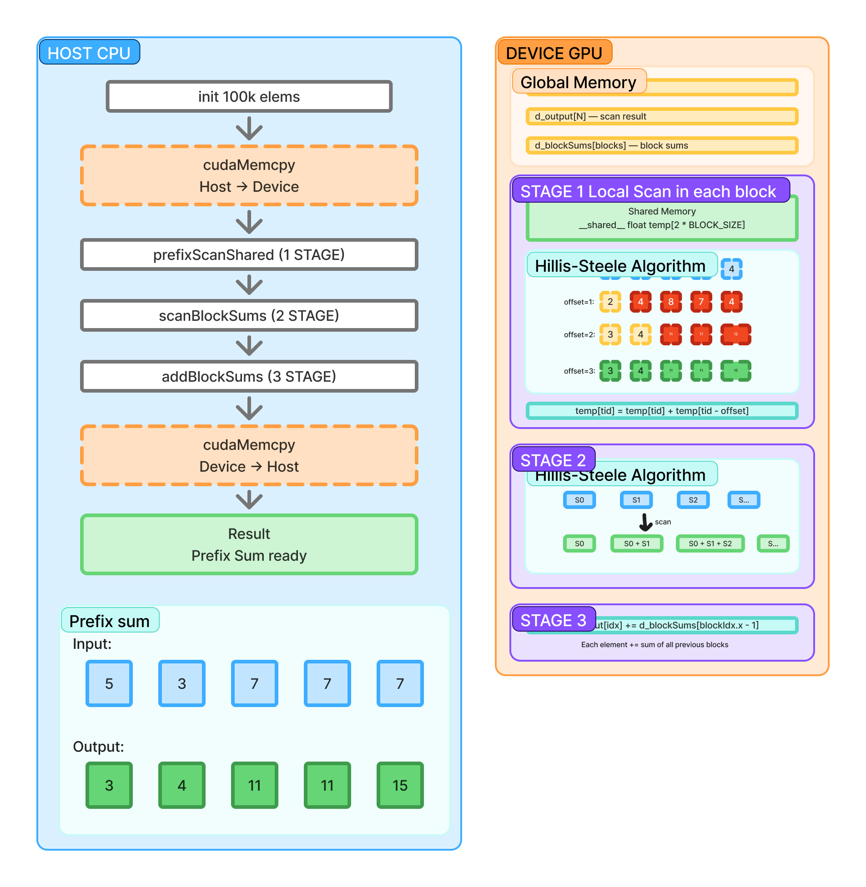

Код: Алгоритм Hillis-Steele

Три этапа: (1) локальный scan в каждом блоке через shared memory

(2) рекурсивный scan сумм блоков

(3) добавление сумм предыдущих блоков к результатам.

Результаты

Schema

HOST запускает три этапа, 

DEVICE показывает shared memory и пошаговую визуализацию 

Hillis-Steele (offset=1,2,4)

Цветами показано: синий=вход, жёлтый=без изменений

оранжевый=вычисляется

зелёный=результат.