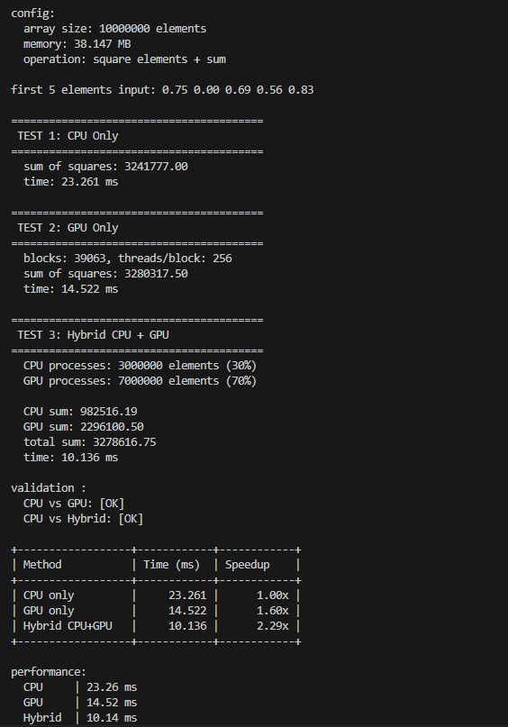
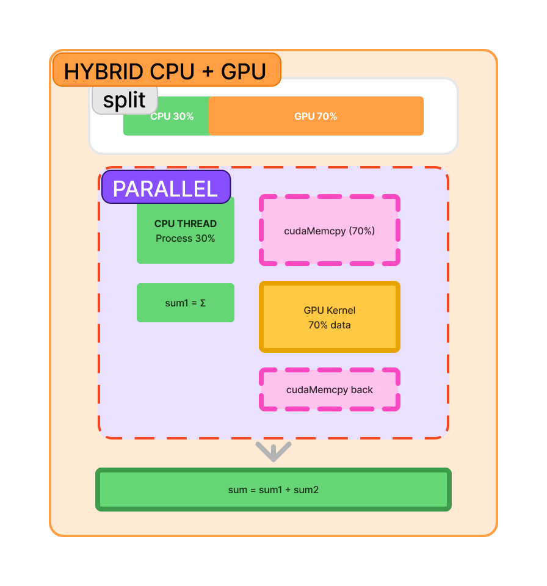

Массив элементов делится 30%/70%

CPU-поток обрабатывает свою часть параллельно с GPU

Оба вычисляют квадраты и суммы, результаты объединяются.

results

schema

В целом нарисовал режим Hybrid. 

В гибриде показан блок "PARALLEL" с одновременной работой CPU и GPU. 

Timeline показывает перекрытие вычислений.