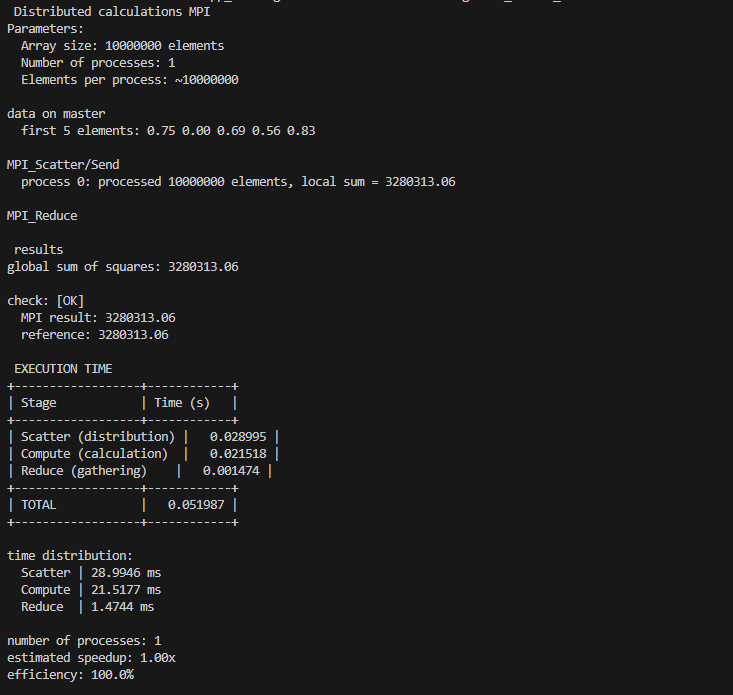

Master (P0) создаёт массив, раздаёт части через MPI_Send, все процессы параллельно считают локальные суммы квадратов, MPI_Reduce собирает глобальную сумму на master.

результаты

схема

Топология Master-Worker (4 узла). 4 этапа: Init → Scatter → Compute → Reduce

Показано разделение массива на 4 части и сбор результатов

График масштабируемости для 1/2/4/8 процессов