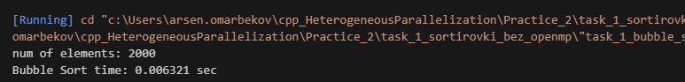
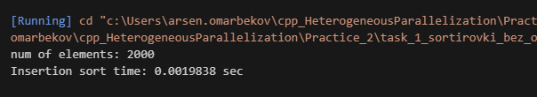
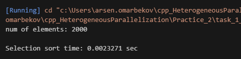

Результаты кодов ниже. После буду обновлять текст

TASK 1 - Реализация реализация сортировок без параллелизма:

Bubble sort

Insertion sort

Selection sort

На массиве из 2000 элементов четко видна разница в производительности алгоритмов. Insertion Sort оказался быстрее остальных, что связано с его особенностью работы - алгоритм минимизирует количество операций сдвига элементов и имеет хорошую кэш-локальность

Selection Sort показал стабильную производительность с небольшим отставанием от Insertion Sort. Алгоритм предсказуем по времени выполнения независимо от входных данных, так как всегда выполняет одинаковое количество сравнений

Bubble Sort значительно отстал от конкурентов, что объясняется его неэффективностью - алгоритм выполняет избыточные сравнения и обмены даже когда массив уже близок к отсортированному состоянию. Каждый проход требует многократных обменов соседних элементов, что создает высокую нагрузку на память

TASK 2 - OpenMP

Bubble sort

Insertion sort

Selection sort

Insertion Sort с OpenMP оказался медленнее обычной версии. Получилось замедление на 30% вместо ускорения. Проблема в том, что каждая вставка элемента зависит от предыдущей вставки - нельзя просто взять и распараллелить весь процесс. Потоки постоянно ждут друг друга из-за критических секций, а время на управление потоками больше чем реальная польза от параллелизма

Selection Sort показал самый плохой результат - стал медленнее почти в 2 раза (замедление 49%). Хотя поиск минимума внутри можно распараллелить, сама суть алгоритма остается последовательной. Получается что на каждом шаге мы запускаем все 16 потоков просто чтобы найти один минимум, а потом потоки снова останавливаются. Слишком много времени тратится на запуск и остановку потоков

Bubble Sort - единственный алгоритм который стал быстрее благодаря параллелизации (ускорение 1.32x). Это работает потому что можно параллельно обрабатывать четные и нечетные пары элементов - они не пересекаются и не мешают друг другу. Но ускорение всего 1.32 раза на 16 потоках говорит о том что эффективность очень низкая - примерно 8%. Большую часть времени потоки просто ждут

TASK 3:

1. В чём основные отличия алгоритмов сортировки пузырьком, выбором и вставкой?

Основное отличие в механизме работы. Bubble Sort последовательно сравнивает соседние элементы и меняет их местами при необходимости, благодаря чему максимальные элементы перемещаются к концу массива

Selection Sort на каждой итерации находит минимальный элемент в неотсортированной части и помещает его на текущую позицию. Это дает минимальное количество обменов (N-1), но требует много сравнений

Insertion Sort формирует отсортированную последовательность постепенно, вставляя каждый новый элемент на правильную позицию в уже отсортированной части. Алгоритм эффективен на частично упорядоченных данных

2. Почему параллельная реализация сортировки вставкой сложнее для выполнения с использованием OpenMP?

Основная проблема в последовательной зависимости операций. Каждая вставка элемента требует знания текущего состояния отсортированной части массива, которое формируется предыдущими вставками. При параллельном выполнении потоки будут конфликтовать при попытке одновременной вставки в общую отсортированную часть. Это требует частых критических секций, что сводит на нет преимущества параллелизма и добавляет overhead синхронизации. В моем эксперименте параллельная версия оказалась медленнее последовательной на 30%.

3. Какие директивы OpenMP были использованы для параллельной реализации алгоритмов?
Применялись следующие директивы: #pragma omp parallel for для распараллеливания циклов с независимыми итерациями, #pragma omp critical для защиты критических секций от одновременного доступа, #pragma omp parallel for reduction для параллельных редукционных операций вроде поиска минимума, #pragma omp atomic для атомарных операций над общими переменными.

4. Какие преимущества и недостатки параллельной реализации алгоритмов сортировки на CPU?
Преимущества включают возможность использования всех доступных ядер процессора для ускорения вычислений, отсутствие необходимости в специализированном оборудовании, относительная простота реализации с OpenMP.
К недостаткам относятся ограниченное количество ядер на CPU, что лимитирует максимальное ускорение. Overhead создания и управления потоками может превысить выигрыш на малых объемах данных. Необходимость синхронизации приводит к простою потоков. Многие алгоритмы имеют последовательные по природе части, которые не поддаются параллелизации

5. Как можно измерить производительность программы в C++?
Для измерения производительности применяется библиотека <chrono> из стандарта C++11. Используется high_resolution_clock::now() для фиксации временных меток до и после выполнения измеряемого участка кода. Разность временных меток дает время выполнения с точностью до наносекунд. Для повышения точности рекомендуется проводить несколько измерений и вычислять среднее значение, исключая первый запуск для прогрева кэша

6. Как изменяется производительность сортировок при увеличении числа потоков?
При малом количестве потоков наблюдается заметное ускорение с минимальным overhead. По мере увеличения до 8-16 потоков прирост производительности замедляется из-за возрастающих затрат на синхронизацию и управление. Закон Амдала ограничивает максимальное ускорение наличием последовательной части кода.
В моих экспериментах на 16 потоках Bubble Sort показал ускорение только 1.32x, что соответствует эффективности около 8%. Selection и Insertion Sort продемонстрировали деградацию производительности

7. В каких ситуациях параллельная сортировка может быть менее эффективной, чем последовательная?
Параллелизация неэффективна при малых объемах данных, когда overhead запуска и управления потоками превышает время полезной работы. При наличии сильных зависимостей данных между итерациями потоки проводят большую часть времени в ожидании. Если количество потоков превышает число физических ядер, возникают дополнительные затраты на переключение контекста. Частые синхронизации через критические секции нивелируют параллелизм